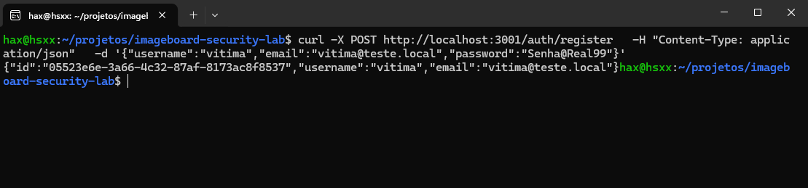
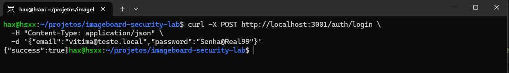
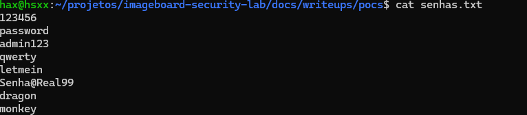
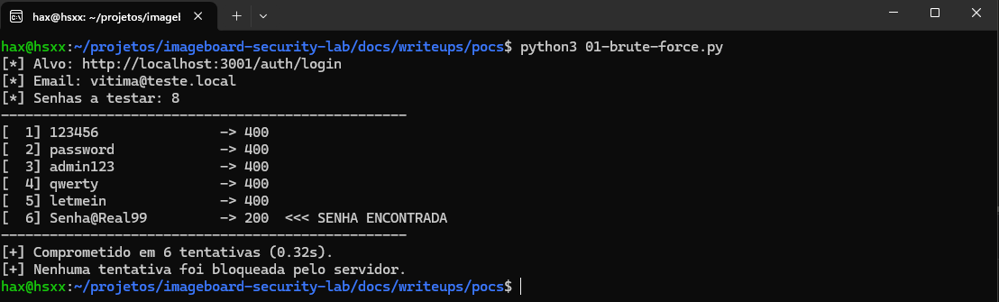
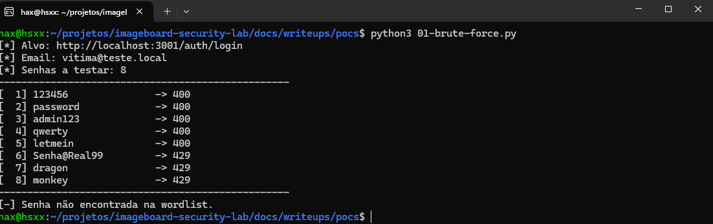

# 01 — Ausência de rate limiting (brute force)

## Classificação

- **OWASP Top 10:** A07:2021 – Identification and Authentication Failures
- **CWE:** CWE-307: Improper Restriction of Excessive Authentication Attempts, CWE-799: Improper Control of Interaction Frequency, CWE-287: Improper Authentication.
- **Severidade:** Alta — a exploração é trivial (ferramentas automatizadas, sem sofisticação) e o impacto é o comprometimento de contas, com escalonamento se a conta for privilegiada.

## Descrição

A ausência de rate limiting é uma vulnerabilidade que habilita ataques de brute force: sem um limite de requisições, o atacante testa credenciais repetidamente até acessar o sistema de forma "legítima", usando as credenciais de uma pessoa já cadastrada.
O endpoint não controlava quantas vezes o cliente já havia tentado logar ou registrar, permitindo tentativas ilimitadas de acesso. Isso abre espaço para a automação, que pode percorrer um dicionário de senhas até encontrar uma válida.

## Código vulnerável

O código legado do sistema não aplicava nenhum middleware de rate limiting nas rotas /login e /register, permitindo requisições POST ilimitadas a esses endpoints. A vulnerabilidade estava explícita: não havia nenhum mecanismo para impedir o brute force.

```typescript
import { Router } from 'express'
import { AuthController } from '../controllers/auth.controller'
import { authMiddleware } from '../middleware/auth.middleware'

const authController = new AuthController()
const router = Router()

router.post('/register', (req, res) => authController.create(req, res))
router.post('/login', (req, res) => authController.login(req, res))
router.post('/logout', (req, res) => authController.logout(req, res))
router.get('/me', authMiddleware, (req, res) => authController.me(req, res))

// CRUD do próprio usuário (logado)
router.patch('/me', authMiddleware, (req, res) => authController.updateProfile(req, res))
router.patch('/me/password', authMiddleware, (req, res) => authController.changePassword(req, res))
router.delete('/me', authMiddleware, (req, res) => authController.deleteAccount(req, res))

export { router as authRoutes }
```

## Prova de conceito

A primeira tentativa foi com o Hydra, ferramenta conhecida para brute force em endpoints. Ela não se adequou ao caso: o módulo `http-post-form` do Hydra envia os dados no formato `application/x-www-form-urlencoded` e usa `:` como separador de campos, o que conflita com o corpo JSON que a rota /login espera.

No lugar do Hydra, escrevi um script Python com a biblioteca requests, enviando o corpo no formato JSON esperado pelo endpoint. Esse script me permitiu explorar a vulnerabilidade na rota /login e obter acesso a um usuário vítima. Utilizei um dicionário pequeno, criado apenas para fins de teste.

**Criação de um usuário vítima**



**Validando se o usuário realmente existe**



**Dicionário de senhas criado**



**Script do brute force em ação**



## Impacto

O impacto de um sistema sem proteção contra brute force é o comprometimento de contas. Com uma wordlist de milhões de possibilidades, o atacante pode assumir uma ou mais contas, roubar credenciais e aplicar golpes; se obtiver acesso a um perfil com privilégios elevados, o ataque escala para além do usuário inicial.
Quanto ao objetivo do atacante: apesar de o volume de requisições afetar a saúde do servidor, a intenção não é derrubá-lo (isso seria um ataque de negação de serviço), e sim obter um status 200 e assumir a identidade de um usuário legítimo para acessar a parte interna do sistema.

## Correção

A correção aplica um limite de requisições nas rotas de autenticação. Utilizei a biblioteca express-rate-limit, solução padrão e mais adotada no ecossistema Express, amplamente testada e validada pela comunidade. Ela se integra como middleware nativo do Express, sem necessidade de soluções improvisadas.
O limite foi aplicado apenas em /login e /register — não em todas as rotas — para não prejudicar a experiência do usuário nos fluxos legítimos, concentrando a proteção nos endpoints sensíveis a brute force. Os parâmetros `windowMs` e `max` definem a janela de tempo e o número máximo de requisições por IP dentro dela: no `authLimiter`, 5 tentativas a cada 15 minutos.
Vale ressaltar que, na configuração padrão, a biblioteca armazena os contadores em memória. Isso funciona para o servidor rodando em localhost, mas, em uma aplicação real com várias instâncias, cada instância teria seu próprio contador, permitindo que o atacante contornasse o limite ao distribuir as requisições. A solução é utilizar um store compartilhado, como o Redis, também suportado pela express-rate-limit.

```typescript
import rateLimit from 'express-rate-limit'

// Limite ESTRITO para autenticação (login/register).
// Objetivo: impedir brute force de senha e criação abusiva de contas.
// 5 tentativas por IP a cada 15 minutos.
export const authLimiter = rateLimit({
  windowMs: 15 * 60 * 1000,   // 15 minutos
  max: 5,                     // 5 requisições por janela, por IP
  standardHeaders: true,      // expõe os headers RateLimit-* (informa o cliente)
  legacyHeaders: false,       // desativa os headers X-RateLimit-* antigos
  message: { error: 'Muitas tentativas. Tente novamente em alguns minutos.' },
})

// Limite MODERADO para criação de posts.
// Objetivo: impedir flood/spam que sobrecarrega o servidor, polui o board
// e consome a cota da API do Gemini (cada post humano dispara os bots).
// 10 posts por IP a cada 1 minuto.
export const postLimiter = rateLimit({
  windowMs: 60 * 1000,        // 1 minuto
  max: 10,                    // 10 posts por janela, por IP
  standardHeaders: true,
  legacyHeaders: false,
  message: { error: 'Você está postando rápido demais. Aguarde um momento.' },
})
```

Aplicado no auth.routes.ts:

```typescript
import { Router } from 'express'
import { AuthController } from '../controllers/auth.controller'
import { authMiddleware } from '../middleware/auth.middleware'
import { authLimiter } from '../middleware/rateLimit.middleware'

const authController = new AuthController()
const router = Router()

router.post('/register', authLimiter, (req, res) => authController.create(req, res))
router.post('/login', authLimiter, (req, res) => authController.login(req, res))
router.post('/logout', (req, res) => authController.logout(req, res))
router.get('/me', authMiddleware, (req, res) => authController.me(req, res))

// CRUD do próprio usuário (logado)
router.patch('/me', authMiddleware, (req, res) => authController.updateProfile(req, res))
router.patch('/me/password', authMiddleware, (req, res) => authController.changePassword(req, res))
router.delete('/me', authMiddleware, (req, res) => authController.deleteAccount(req, res))

export { router as authRoutes }
```



## Limitações da correção

O rate limiting não é uma solução completa. Ele é apenas uma camada de proteção e não cobre cenários como rotação de IPs (que zera o contador por origem), ataques low-and-slow (que ficam abaixo do limite) e credential stuffing (que precisa de uma única tentativa por conta). Nenhum mecanismo isolado elimina o risco; o que se busca é a defesa adequada para cada aplicação. Neste caso, criamos uma barreira que dificulta o brute force, e é a combinação de diversos mecanismos — apresentados nos próximos writeups, como MFA e limite por conta — que aproxima a defesa do ideal.

## Referências

- [OWASP — Brute Force Attack](https://owasp.org/www-community/attacks/Brute_force_attack)
- [OWASP — Credential Stuffing](https://owasp.org/www-community/attacks/Credential_stuffing)
- [OWASP Authentication Cheat Sheet](https://cheatsheetseries.owasp.org/cheatsheets/Authentication_Cheat_Sheet.html)
- [OWASP Multifactor Authentication Cheat Sheet](https://cheatsheetseries.owasp.org/cheatsheets/Multifactor_Authentication_Cheat_Sheet.html)