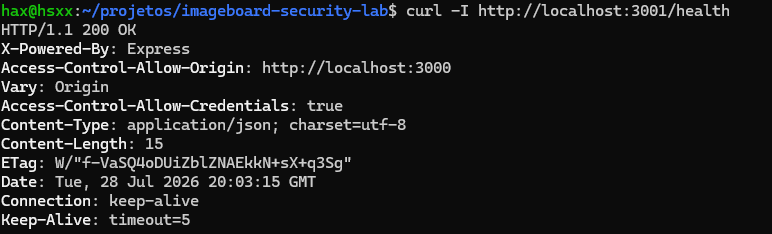
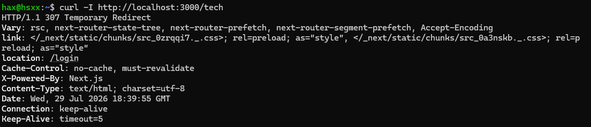
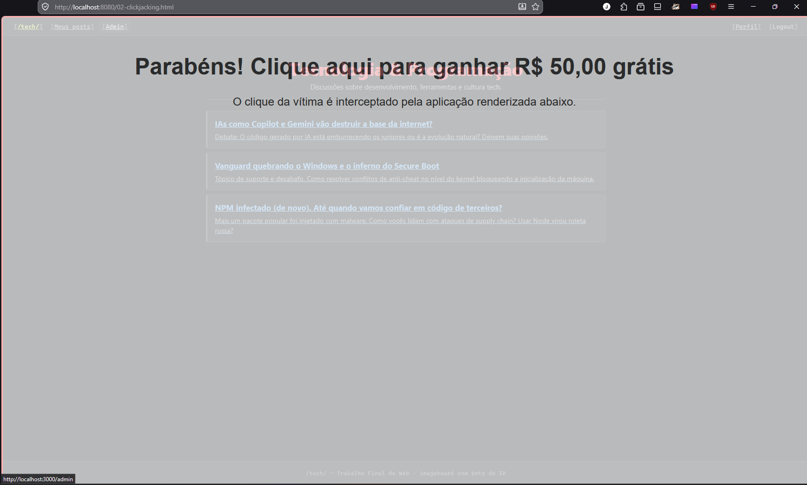
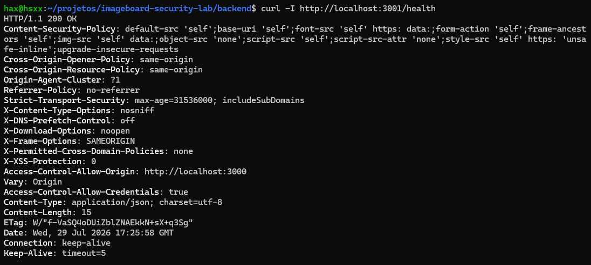
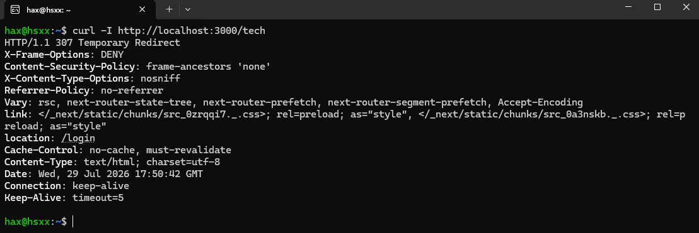
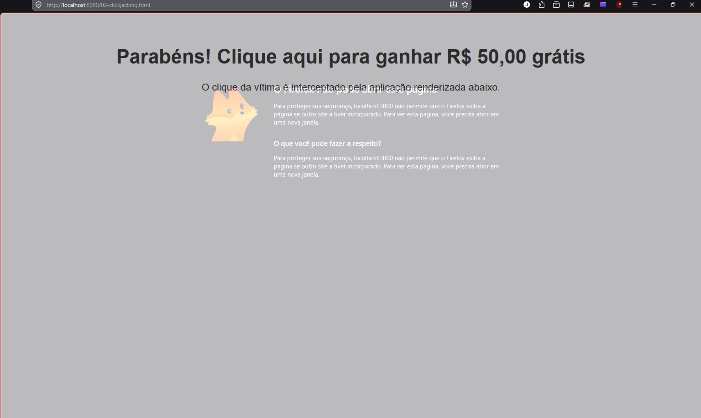

# 02 — Ausência de security headers

## Classificação

- **OWASP Top 10:** A05:2021 – Security Misconfiguration
- **CWE:** CWE-1021 (Improper Restriction of Rendered UI Layers or Frames) e CWE-200 (Exposure of Sensitive Information) para o X-Powered-By
- **Severidade:** Média — a exploração exige engenharia social (induzir a vítima a acessar a página maliciosa), mas o impacto pode ser alto se a ação sequestrada for destrutiva ou administrativa

## Descrição

Os security headers são cabeçalhos que o servidor envia na resposta HTTP para instruir o navegador a ativar proteções nativas. Essas proteções existem no navegador, mas vêm desativadas por padrão: sem o header correspondente, o navegador opera em modo permissivo e não bloqueia comportamentos que deveriam ser negados.

No sistema havia duas situações distintas. A primeira era a ausência de headers de proteção: sem X-Frame-Options (ou a diretiva frame-ancestors do CSP), qualquer site podia embutir a aplicação em um iframe e viabilizar o clickjacking; sem X-Content-Type-Options: nosniff, o navegador podia adivinhar o tipo de um arquivo e tratá-lo de forma diferente da declarada. A segunda era um header presente que não deveria estar ali: o X-Powered-By entregava o framework utilizado — Express no backend e Next.js no frontend —, facilitando o reconhecimento por parte do atacante.

## Código / configuração vulnerável

Saída do curl -I do backend antes da implementação do Helmet, sem headers de segurança e com o X-Powered-By: Express exposto:



Saída do curl -I do frontend antes da implementação dos headers, sem proteção contra enquadramento e com o X-Powered-By: Next.js:



## Prova de conceito

Para demonstrar que a ausência era explorável, escrevi uma página de clickjacking que simula um anúncio de isca — "Parabéns! Clique aqui para ganhar R$ 50,00 grátis" — e carrega a aplicação-alvo por cima dela, em um `<iframe>` posicionado em tela cheia. A vítima acredita estar clicando no anúncio, mas o clique atravessa a isca e atinge a aplicação legítima renderizada acima.

```html
<div class="isca">
  <h1>Parabéns! Clique aqui para ganhar R$ 50,00 grátis</h1>
</div>

<iframe src="http://localhost:3000/tech"></iframe>
```

```css
iframe {
  position: absolute;
  top: 0; left: 0;
  width: 100%; height: 100%;
  opacity: 0.3;          /* 0 em um ataque real — 0.3 apenas para o print */
  border: 3px solid red; /* idem: demarca a área enquadrada na demonstração */
}
```

O `opacity: 0.3` e a borda vermelha não fazem parte do ataque: eles existem só para tornar o iframe visível no registro. Em um ataque real a opacidade seria `0` e a borda removida, deixando a vítima ver apenas a isca enquanto interage com o site legítimo.

Servi a página de ataque com `python3 -m http.server 8080`, e não abri o arquivo direto pelo `file://`. A razão é que o `file://` tem origem opaca (`null`), o que não reproduz o cenário real: o ataque acontece entre dois sites com origens HTTP distintas. Servindo em `http://localhost:8080`, o exploit passa a ter uma origem legítima e diferente da do alvo (`http://localhost:3000`) — é uma requisição cross-origin de verdade, que é exatamente o que os headers deveriam recusar.

O que prova a vulnerabilidade é o iframe carregar. A decisão de permitir ou não o enquadramento é do navegador, e ele a toma com base nos headers da resposta do alvo. Se o X-Frame-Options ou a diretiva frame-ancestors do CSP estivessem presentes, o navegador recusaria a renderização e a área ficaria em branco. O conteúdo aparecer significa que a resposta não trouxe nenhuma instrução restringindo quem pode enquadrá-la.

Clickjacking funcionando, com a aplicação renderizada dentro da página da isca:



O print reúne três detalhes que agravam o achado. A barra de endereços mostra localhost:8080, e não localhost:3000: o usuário está em um site controlado pelo atacante e não tem como perceber que interage com outro. A sessão da vítima veio junto — a navegação dentro do iframe exibe as opções Perfil, Logout e Admin, porque o cookie de sessão foi enviado na requisição enquadrada e a aplicação respondeu com a área autenticada; o atacante não embute uma página pública qualquer, e sim a conta da vítima já logada. Por fim, com o cursor sobre a isca, a barra de status do navegador (canto inferior esquerdo) exibe http://localhost:3000/admin, um link de dentro do iframe e não da página do atacante, o que confirma que a interação é repassada à aplicação real.

Vale a ressalva de que esta PoC prova a precondição do clickjacking: o enquadramento é permitido e recebe a sessão autenticada. Um ataque completo daria o passo seguinte, alinhando a isca com precisão sobre um controle específico do alvo para induzir uma ação concreta. Para evidenciar a ausência do header, provar o enquadramento basta — é ele que o header existe para bloquear.

## Impacto

O impacto do clickjacking é elevado em sistemas bancários ou que armazenam informações sensíveis dos usuários. O ataque sobrepõe uma isca sobre um controle real da página e desvia a ação da vítima: ela acredita clicar em um elemento inofensivo, mas aciona uma função da aplicação legítima — em uma área autenticada, isso significa executar uma operação em nome dela sem o seu conhecimento, o que pode levar ao roubo de dados ou à alteração de conteúdo do sistema. O print da prova de conceito reforça a gravidade, já que a página embutida exibia a área logada da vítima.

A exposição do framework pela ausência do controle sobre o X-Powered-By tem impacto indireto, mas relevante. Ao entregar que a aplicação roda em Express e Next.js, o header dá ao atacante um ponto de partida para o reconhecimento: ele passa a buscar as vulnerabilidades já catalogadas para aquelas tecnologias e versões, reduzindo o esforço necessário para encontrar um vetor explorável.

## Correção

A correção teve início a partir do curl -I, que mostrou quais headers estavam ausentes. Com esse diagnóstico, instalei no backend a biblioteca Helmet. Com uma única chamada de `app.use(helmet())`, ela aplica um conjunto de headers de segurança por padrão: remove o X-Powered-By, insere o X-Content-Type-Options: nosniff, os headers de isolamento de origem (Cross-Origin-Opener-Policy e Cross-Origin-Resource-Policy), o HSTS e até o X-Frame-Options: SAMEORIGIN. É a proteção da camada de API do sistema.

```typescript
// backend — app.ts (Helmet)
import helmet from 'helmet';

const app = express();

app.use(helmet());
```

Ao rodar o clickjacking novamente, percebi que a segurança aplicada no backend não foi suficiente: o ataque com iframe continuava funcionando. Isso é curioso à primeira vista, já que o Helmet havia setado o X-Frame-Options: SAMEORIGIN — mas esse header foi aplicado na camada errada. O curl -I do frontend explicou o porquê: a ausência de headers se mantinha ali, e é o frontend que serve o HTML. A API do backend entrega apenas JSON, e não a página que o navegador renderiza dentro do iframe; nada enquadra a API, então o header anti-enquadramento do Helmet nunca é consultado nesse ataque. A conclusão central é que o clickjacking se defende na camada que serve o HTML. Apliquei então os headers no next.config.ts, incluindo o X-Frame-Options: DENY, o frame-ancestors 'none' do CSP e a supressão do X-Powered-By: Next.js.

```typescript
// frontend — next.config.ts (headers)
const nextConfig: NextConfig = {
  // Suprime o header X-Powered-By (information disclosure).
  poweredByHeader: false,

  // Security headers na camada que serve o HTML (mitiga clickjacking na origem).
  async headers() {
    return [
      {
        source: "/:path*",
        headers: [
          { key: "X-Frame-Options", value: "DENY" },
          { key: "Content-Security-Policy", value: "frame-ancestors 'none'" },
          { key: "X-Content-Type-Options", value: "nosniff" },
          { key: "Referrer-Policy", value: "no-referrer" },
        ],
      },
    ];
  },
};
```

Backend após a inserção dos headers, com o curl -I já sem o X-Powered-By:



Frontend após a inserção dos headers, com o X-Frame-Options: DENY presente na resposta:



Clickjacking bloqueado: com o header presente, o navegador recusa carregar o iframe e a área da aplicação fica em branco.



## A distinção backend vs frontend

Aqui ficou claro que proteger apenas uma parte do sistema, como o backend, não é suficiente. Os response headers precisam estar na resposta que o navegador renderiza como página, e não em qualquer resposta da aplicação, devido à natureza do ataque: o clickjacking atua sobre o HTML, então a defesa tem de estar na camada que serve esse HTML — o frontend.

O princípio geral é que, em uma arquitetura frontend/backend separada, cada camada tem a sua própria superfície de segurança e precisa da sua própria proteção. O backend não pode entregar informações do seu framework, e o frontend também não; cada camada protege a sua parte, e é a soma delas que resulta em uma segurança consistente para o sistema como um todo.

## Observações

Em relação ao header X-XSS-Protection: 0, o seu intuito é controlar um recurso de proteção de navegadores antigos chamado XSS Auditor. Ao bater o olho, pode-se pensar que essa opção está sendo desativada e enfraquecendo o sistema, mas é o contrário: o XSS Auditor foi abandonado pelos navegadores modernos porque o próprio filtro criava vulnerabilidades em vez de preveni-las. A solução adotada pelos navegadores atuais é o Content-Security-Policy (CSP): em vez de um filtro que tentava adivinhar o que é e o que não é ataque, o CSP declara explicitamente de onde os scripts podem vir e recusa todo o resto.

O HSTS em execução na máquina local não faz diferença, já que ele só atua sobre HTTPS. Ainda assim, deixá-lo configurado significa que, quando houver um deploy do projeto com HTTPS ativado, a proteção já estará presente.

O nosniff foi aplicado preventivamente. A aplicação hoje não serve arquivos de usuário, mas, caso esse recurso venha a ser implementado, o header já protege contra o vetor de MIME sniffing desde o início.

## Referências

- [MDN — X-Frame-Options](https://developer.mozilla.org/en-US/docs/Web/HTTP/Reference/Headers/X-Frame-Options)
- [MDN — X-Content-Type-Options](https://developer.mozilla.org/en-US/docs/Web/HTTP/Reference/Headers/X-Content-Type-Options)
- [MDN — Content Security Policy (CSP)](https://developer.mozilla.org/en-US/docs/Web/HTTP/Guides/CSP)
- [MDN — Clickjacking](https://developer.mozilla.org/en-US/docs/Web/Security/Attacks/Clickjacking)
- [Helmet.js](https://helmetjs.github.io/)
