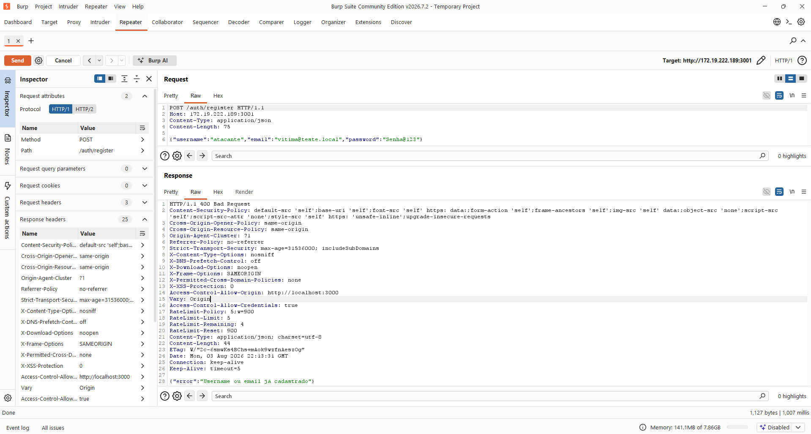
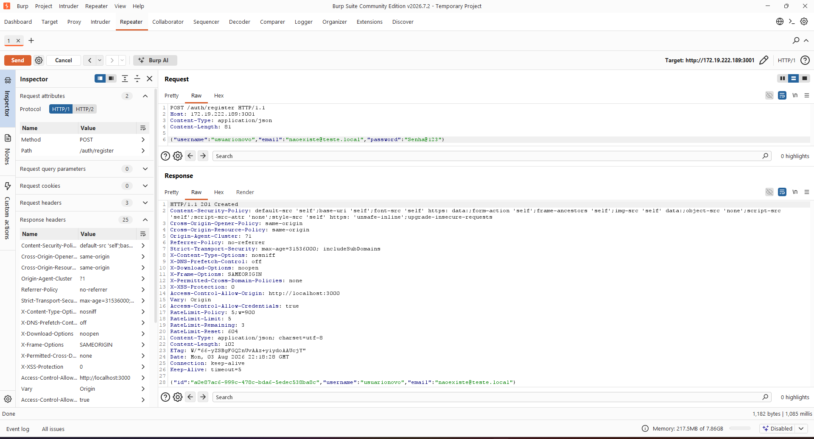
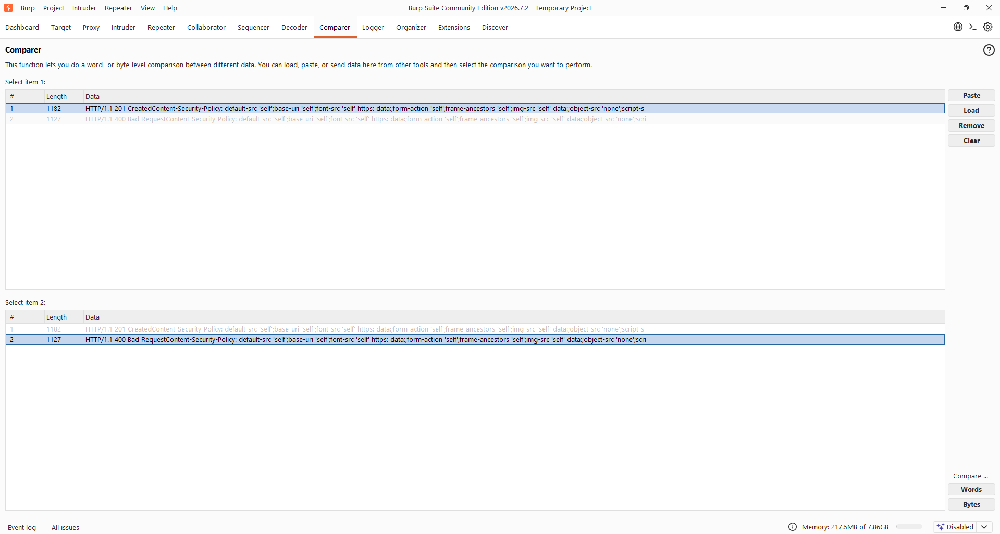
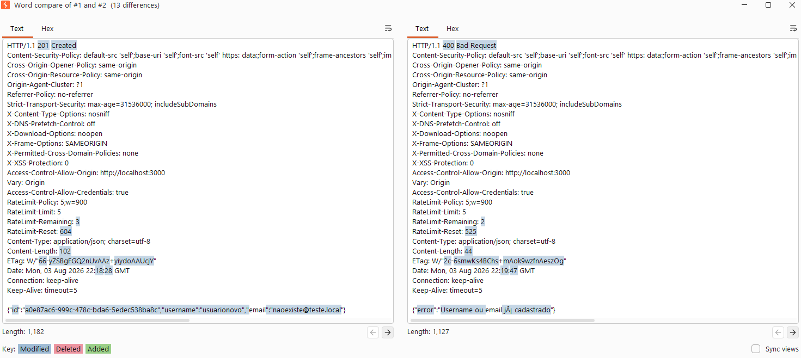
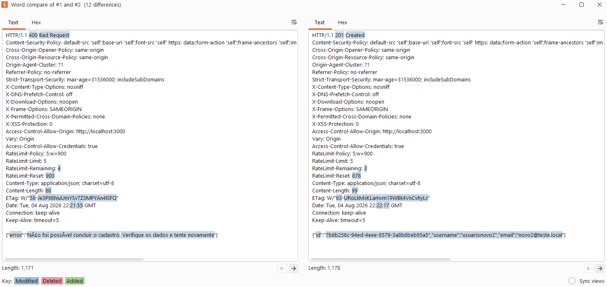
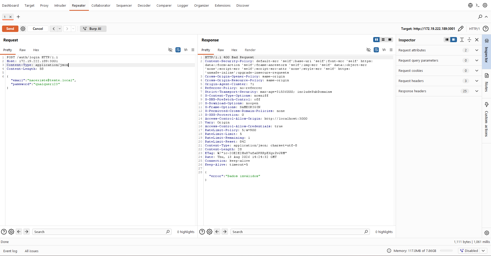
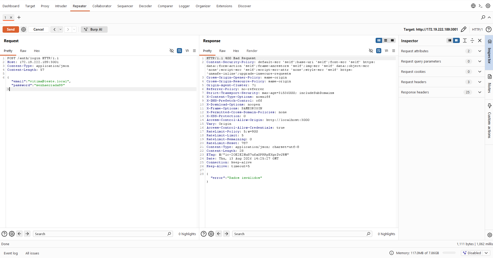
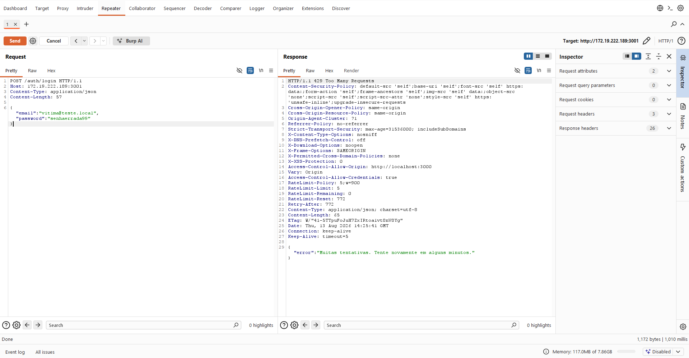

# 03 — User enumeration

## Classificação

- **OWASP Top 10:** A07:2021 – Identification and Authentication Failures
- **CWE:** CWE-204: Observable Response Discrepancy (diferença na mensagem e no status HTTP), CWE-208: Observable Timing Discrepancy (diferença no tempo de resposta).
- **Severidade:** Média — o user enumeration não invade o sistema por si só, ele restringe as possibilidades do atacante e aumenta a taxa de sucesso de ataques como o brute force.

## Descrição

User enumeration é um ataque auxiliar que tem por objetivo descobrir a existência de contas na aplicação, observando as respostas geradas por ela. Não é um ataque que descobre senhas: ele descobre quais contas existem, e o resultado é a lista de alvos válidos que alimenta o brute force do writeup 01.

Tudo que é devolvido pelo servidor é utilizado para essa análise: o status HTTP, o tempo de resposta (timing), a mensagem gerada ("usuário já cadastrado", "email já cadastrado", "senha incorreta", etc.) e o tamanho da resposta. Basta que a aplicação se comporte de um jeito quando a conta existe e de outro quando não existe, e essa diferença — por menor que seja — vira um oráculo para o atacante.

## Metodologia e mapeamento

O mapeamento foi feito de forma sistemática, e não apenas no registro, que é o caso óbvio. Varri os fluxos de /auth e de usuário — /register, /login, /auth/me e /auth/me/password — procurando onde a resposta difere entre "a conta existe" e "a conta não existe". A tabela abaixo resume o que encontrei.

| Endpoint | Vaza por | Rate limit? | Gravidade | Ação |
|----------|----------|-------------|-----------|------|
| `POST /auth/register` | mensagem + timing | Sim (5/15min) | Média | corrigido |
| `PATCH /auth/me` | mensagem + timing | Não (era o pior) | Grave | corrigido |
| `POST /auth/login` | timing (mensagem já genérica) | Sim | Média | timing normalizado |
| `PATCH /auth/me/password` | — (busca por id do token) | — | não enumerável | sem ação |

A gravidade de cada linha veio menos do vazamento em si e mais do quanto ele podia ser explorado em escala. O /register e o /login vazavam, mas já estavam atrás do authLimiter, o que obriga o atacante a um ataque lento. O /auth/me vazava a mesma informação e não tinha limite nenhum, então era o pior dos três: um atacante com uma conta qualquer no sistema podia varrer emails à vontade, sem barreira. Já o /auth/me/password não é enumerável, porque ele busca o usuário pelo id que vem do token, e não por um dado que o atacante escolhe — não existe entrada para varrer.

## Prova de conceito

Para esta PoC utilizei o Burp Suite, no Repeater, com as requisições em RAW para averiguar e comparar as respostas. Não utilizei o Intruder por dois motivos: o que eu queria era comparar poucas respostas com atenção, e não disparar volume, e a versão Community limita a velocidade do Intruder de qualquer forma. Um detalhe do ambiente que atrapalhou no começo: o Burp está instalado no Windows e não alcançava o localhost do WSL. A solução foi mirar o IP da máquina em vez de localhost.

O comportamento descrito a seguir é o do sistema antes da correção. Nas requisições POST em /register e PATCH em /auth/me, a resposta entregava se o usuário já existia: a mensagem exibida na época era "Username ou email já cadastrado" no /register e "Username ou email já em uso" no /auth/me. No /login a mensagem já era genérica, mas o vazamento estava no tempo: quando o email não existia, o erro "Dados inválidos" voltava na hora, enquanto com um email cadastrado a resposta demorava mais, porque só nesse caso o bcrypt.compare chegava a ser executado.

Esse vazamento por tempo é medido no próprio Repeater, que exibe a duração da requisição no canto inferior direito da janela. A medição está registrada na seção da correção, onde ela serve para comprovar que os dois casos passaram a responder no mesmo tempo.

A prova foram duas requisições de registro idênticas, mudando apenas o email. A primeira com `vitima@teste.local`, uma conta que já existia:



A segunda com `naoexiste@teste.local`, que não existia, e por isso foi criada:



Com as duas respostas em mãos, carreguei ambas no Comparer. A diferença já aparece na listagem, antes de qualquer análise: 1.182 bytes contra 1.127. Só o tamanho da resposta já serve de oráculo.



A comparação por Words destaca as diferenças: à esquerda o 201 Created, com o corpo contendo id, username e email da conta criada; à direita o 400 Bad Request, com a mensagem que confirma o cadastro. O status, o tamanho e a mensagem apontam para a mesma conclusão, e qualquer um dos três sozinho já responde a pergunta que o atacante quer fazer.



## Impacto

O user enumeration é um recurso que enriquece a wordlist utilizada pelo atacante no brute force — uma lista pré-montada de emails, usernames e senhas, que pode ser obtida de várias formas, como um vazamento. Com o mapeamento em mãos, o atacante descarta o que não existe e ataca somente as contas confirmadas, o que torna o brute force e o credential stuffing muito mais eficientes. Isso pesa ainda mais quando existe rate limit: se cada tentativa é cara e o ataque precisa ser low-and-slow, gastar tentativas em contas inexistentes é desperdício, e quanto mais certeza há na wordlist, mais impactante o ataque se torna.

Vale destacar o achado da varredura: a rota /auth/me não tinha rate limit algum. Isso permitia que um atacante já logado no sistema — e criar uma conta é gratuito — enumerasse emails de forma irrestrita, testando um endereço atrás do outro sem nunca ser barrado.

## Correção

A primeira correção foi trocar as mensagens do /register e do /auth/me por mensagens genéricas, que não afirmam nada sobre a existência da conta. Isso mitiga o vazamento pela mensagem, mas não o elimina, porque o comportamento da aplicação continua diferente nos dois casos: o status HTTP ainda entrega o que a frase passou a esconder. Fechar isso por completo exigiria confirmação por email, como nas aplicações modernas, o que foge do escopo de um projeto pequeno e local, onde seria necessário um provedor externo e, na prática, uma API paga.

No registro, além da mensagem, mexi na ordem das operações: o hash da senha passou a ser calculado antes da consulta que verifica se a conta já existe. O bcrypt é a operação cara do fluxo, na casa dos 100ms, e antes ele só rodava quando o cadastro seguia adiante — ou seja, o caminho "usuário já existe" respondia visivelmente mais rápido, e essa diferença era medível de fora. Com o hash antes do findFirst, os dois caminhos passam a pagar o mesmo custo dominante. Não é uma equalização perfeita: quando a conta não existe, ainda há o `prisma.user.create`, que o caminho de erro não executa. Mas isso são poucos milissegundos contra os cerca de 100ms do bcrypt, e o sinal que dava para medir pela rede era o do bcrypt.

```typescript
// backend — auth.service.ts (register: hash antes do findFirst + mensagem genérica)
async create(username: string, email: string, password: string) {

  //fazer o hash da password antes para que evite um pouco do timing
  const passwordHashed = await bcrypt.hash(password, 10)

  const isUserCreated = await prisma.user.findFirst({
    where: {
      OR: [{ username }, { email }]
    }
  })

  if (isUserCreated) {
    throw new Error('Não foi possível concluir o cadastro. Verifique os dados e tente novamente')
  }

  const user = await prisma.user.create({
    data: { username, email, password: passwordHashed }
  })

  return { id: user.id, username: user.username, email: user.email }
}
```

Repetindo a comparação no Comparer depois da correção, a mensagem não distingue mais os casos: o 400 responde "Não foi possível concluir o cadastro. Verifique os dados e tente novamente". O mesmo print também mostra o limite dessa correção, já que o 400 contra o 201, e o corpo com os dados do usuário criado, continuam ali.



Para o /auth/me criei um limiter próprio, o profileLimiter, em vez de reaproveitar o authLimiter. Os dois protegem ações de naturezas diferentes: login e registro são tentativas frequentes e legítimas, e por isso 5 tentativas a cada 15 minutos fazem sentido lá. Editar o perfil é uma ação rara e deliberada, um usuário legítimo não troca de username ou email várias vezes por hora. Três alterações por hora praticamente não incomodam o uso normal, mas inviabilizam a varredura: onde antes o atacante logado testava emails sem restrição alguma, agora ele tem três tentativas e depois espera uma hora.

```typescript
// backend — rateLimit.middleware.ts
// Limite ESTRITO para edição de perfil.
// Editar dados (username/email) é uma ação rara e deliberada, então uma
// janela longa com poucas tentativas dificulta a varredura de emails
// (enumeration) via endpoint de atualização, sem incomodar o uso legítimo.
export const profileLimiter = rateLimit({
  windowMs: 60 * 60 * 1000,  // 1 hora
  max: 3,
  standardHeaders: true,
  legacyHeaders: false,
  message: { error: 'Muitas alterações de perfil. Tente novamente mais tarde.' },
})

// backend — auth.routes.ts
router.patch('/me', authMiddleware, profileLimiter, (req, res) => authController.updateProfile(req, res))
```

Uma ressalva sobre o alcance dessa proteção: na configuração padrão a express-rate-limit conta por IP, e o cenário aqui é o de um atacante que já está logado. Ele não precisa de vários IPs para criar contas, basta trocar de IP para zerar o contador e continuar a varredura com a mesma sessão. O caminho para fechar isso é contar por conta em vez de por origem, usando um `keyGenerator` com o id do usuário autenticado, já que o /auth/me só é alcançado depois do authMiddleware. Vale a mesma observação do writeup 01 sobre o contador em memória, que não sobrevive a múltiplas instâncias.

No login a mensagem já era genérica, mas o tempo de resposta não era. Como o bcrypt.compare só rodava quando a conta existia, a resposta rápida denunciava o email não cadastrado. A correção foi rodar o bcrypt.compare sempre, com o mesmo custo: contra a senha real quando a conta é válida, ou contra um hash descartável quando não é. Nesse segundo caso não há nada para validar — a comparação existe apenas para pagar o mesmo preço em tempo e fechar o canal.

```typescript
// backend — auth.service.ts (login: dummy hash para normalizar o timing)

// Hash descartável usado no login quando a conta não existe / é bot / não tem
// senha. Serve para o bcrypt.compare rodar SEMPRE com o mesmo custo (10),
// de modo que o tempo de resposta não revele se o email existe — mitiga a
// enumeração de usuários por timing. É o hash de uma senha aleatória: nenhuma
// senha informada pelo usuário jamais confere com ele.
const DUMMY_HASH = bcrypt.hashSync('conta-inexistente-timing-guard', 10)

async login(email: string, password: string) {
  const user = await prisma.user.findUnique({
    where: { email }
  })

  // Uma conta só é elegível ao login se existe, não é bot e tem senha.
  const contaValida = !!user && !user.isAI && !!user.password

  // O bcrypt.compare roda SEMPRE, com o mesmo custo: contra a senha real
  // quando a conta é válida, ou contra um hash descartável caso contrário.
  // Assim o tempo de resposta não revela se o email existe (anti-enumeração).
  const hashParaComparar = contaValida ? user!.password! : DUMMY_HASH
  const senhaMatch = await bcrypt.compare(password, hashParaComparar)

  // Mensagem única para todos os motivos de falha, sem distinguir os casos.
  if (!contaValida || !senhaMatch) {
    throw new Error('Dados inválidos')
  }

  // Após o guard acima, contaValida é true — logo user não é nulo.
  const token = jwt.sign(
    { id: user!.id, username: user!.username, isAdmin: user!.isAdmin },
    process.env.JWT_SECRET!,
    { expiresIn: '5h' }
  )

  return { token }
}
```

Após a correção, medindo no Repeater, o login com email inexistente respondeu em ~1.061ms e com email existente em ~1.062ms — diferença dentro do ruído. O tempo de resposta deixou de distinguir os dois casos, confirmando a normalização. As medições são poucas porque o próprio rate limit (5/15min) limita a amostragem, o que por si só reforça que a enumeração por timing, além de fechada no sinal dominante, esbarraria no limite de tentativas.





O limite da amostragem aparece na própria tela: o RateLimit-Remaining chega a 0 e a tentativa seguinte volta 429 Too Many Requests, com a mensagem do authLimiter e o Retry-After. É o rate limit do writeup 01 barrando a coleta de medições, que é exatamente o que ele faria com a varredura de um atacante.



## Vetores residuais

As correções fecharam os vetores exploráveis, mas não eliminaram o problema por completo. O que sobrou está registrado aqui porque foi decisão de escopo, e não descuido.

O primeiro resíduo é o oráculo por status code no /register e no /auth/me. Mesmo com a mensagem genérica, o comportamento continua diferente: quando a conta já existe, a resposta é 400; quando não existe, é 201 no registro e o sucesso da atualização no perfil. É o que aparece no Word compare do "depois", na seção anterior — a mensagem foi neutralizada, mas o par 400/201 e o corpo com os dados do usuário criado seguem no lugar. O atacante deixa de ler a frase e passa a ler o status. Eliminar isso exigiria confirmação por email: a aplicação responderia sempre igual, e a informação de que o email já está cadastrado seria enviada para a caixa de entrada, que só o dono acessa. Isso é uma mudança de arquitetura, não um ajuste de código, porque envolve provedor de email, token de verificação e um estado intermediário de conta não confirmada.

Vale explicar por que não basta responder 201 sempre, que é a saída aparentemente fácil. O status não é decorativo, ele informa ao cliente o que de fato aconteceu. Se o registro devolvesse 201 sem criar a conta, o frontend mandaria o usuário para o login com uma conta que não existe, e ele ficaria preso em um erro sem explicação; no /auth/me seria pior, porque a tela exibiria o perfil como atualizado enquanto o banco manteve o valor antigo. Mentir no status quebra a aplicação para quem é legítimo, e nem resolve para quem é atacante, já que ele continua tendo o tamanho da resposta e o corpo para comparar. É por isso que a solução correta é mudar o fluxo, e não falsificar a resposta.

Esse resíduo fica mitigado pelos rate limits, que são 5 tentativas por 15 minutos no /register e 3 por hora no /auth/me. A enumeração deixa de ser uma varredura automatizada de listas inteiras e passa a ser um ataque lento, caro e com rastro suficiente nos logs para ser percebido. A mitigação tem o alcance de qualquer limite por IP, como já comentei na correção: quem rotaciona origens dilui o limite, e é por isso que ela reduz o problema em vez de encerrá-lo.

O segundo resíduo é o timing de segunda ordem no login. O dummy hash fechou o sinal dominante, os cerca de 100ms do bcrypt, que era o único mensurável com confiança pela rede. Em tese ainda resta a diferença de latência do próprio findUnique entre achar e não achar o registro, mas ela fica na casa de frações de milissegundo, abaixo do ruído da rede, do agendamento do event loop e da variação do próprio banco. Fechar até isso exigiria resposta em tempo constante no endpoint inteiro, atrasando toda requisição até um teto fixo, o que adiciona complexidade e latência para todo mundo por causa de um sinal que não é explorável de forma confiável.

## Referências

- [OWASP WSTG — Account Enumeration](https://owasp.org/www-project-web-security-testing-guide/latest/4-Web_Application_Security_Testing/03-Identity_Management_Testing/04-Testing_for_Account_Enumeration_and_Guessable_User_Account.html)
- [PortSwigger — Authentication](https://portswigger.net/web-security/authentication/password-based)
- [OWASP Authentication Cheat Sheet](https://cheatsheetseries.owasp.org/cheatsheets/Authentication_Cheat_Sheet.html)
